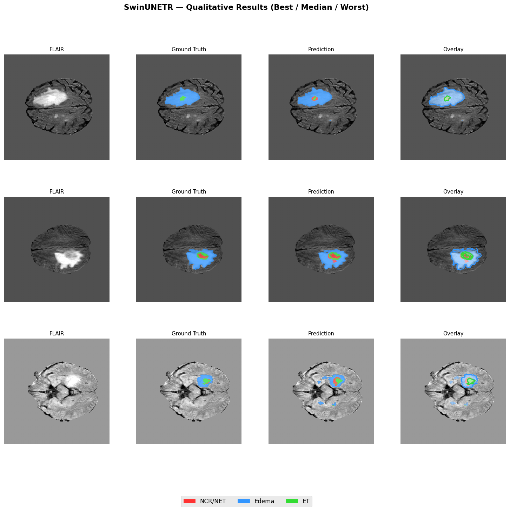

# 🧠 Brain Tumor 3D Segmentation (BraTS 2020)



A deep learning project for **3D brain tumor segmentation from multi-modal MRI scans**, implemented as a complete pipeline in a **Kaggle notebook environment**.

---

## 🎯 Overview

This project explores how deep learning can be applied to **voxel-level tumor segmentation** using the **BraTS 2020 dataset**.

The full workflow includes:

**MRI → Preprocessing → Training → Evaluation → Failure Analysis → Explainability**

---

## 📓 Notebook

The entire project is implemented in a single notebook:

```
BrainTumorSegmentation-BraTS2020.ipynb
```

👉 **Run it directly on Kaggle (recommended):**
[https://www.kaggle.com/code/markomilenovi/3d-brain-tumor-segmentation-brats2020](https://www.kaggle.com/code/markomilenovi/3d-brain-tumor-segmentation-brats2020)

Inside the notebook, you will find:

* Data loading (NIfTI MRI volumes)
* Preprocessing & normalization
* Patch-based training strategy
* Model implementations:

  * UNet3D
  * SegResNet
  * SwinUNETR
* Evaluation (Dice metrics: WT, TC, ET)
* Failure case analysis
* Uncertainty estimation & visualization

---

## 🧲 MRI Modalities

Each patient includes four MRI sequences:

* **T1** — anatomical structure
* **T1CE** — contrast-enhanced tumor
* **T2** — fluid-sensitive
* **FLAIR** — edema detection

---

## 🧩 Task

Multi-class 3D segmentation:

| Label | Description                   |
| ----- | ----------------------------- |
| 0     | Background                    |
| 1     | Necrotic / Non-enhancing core |
| 2     | Edema                         |
| 4     | Enhancing tumor               |

---

## 🧪 Evaluation

Performance is measured using **Dice scores**:

* WT (Whole Tumor)
* TC (Tumor Core)
* ET (Enhancing Tumor)

---

## 🧠 Key Features

* End-to-end **3D medical imaging pipeline**
* Comparison of multiple architectures
* Patch-based training for memory efficiency
* Failure case analysis (clinically relevant)
* Model uncertainty estimation (interpretability)

---

## 📊 Key Insights

* Preprocessing is critical for 3D segmentation performance
* Patch sampling strongly impacts results
* Dice score alone is not sufficient → failure analysis is essential
* Uncertainty maps align with real model errors

---

## 🚀 How to Run

This project was developed in **Kaggle**, so no local setup is required.

👉 Simply open and run the notebook here:
[https://www.kaggle.com/code/markomilenovi/3d-brain-tumor-segmentation-brats2020](https://www.kaggle.com/code/markomilenovi/3d-brain-tumor-segmentation-brats2020)

---

## 📦 Dataset

This project uses the **BraTS 2020 dataset**.

Due to size constraints, the dataset is **not included** in this repository.
It is accessed directly through the Kaggle environment.

---

## 🔗 Links

* 📘 Kaggle Notebook:
  [https://www.kaggle.com/code/markomilenovi/3d-brain-tumor-segmentation-brats2020](https://www.kaggle.com/code/markomilenovi/3d-brain-tumor-segmentation-brats2020)

* 💼 LinkedIn:
  [https://www.linkedin.com/in/marko-milenovic01/](https://www.linkedin.com/in/marko-milenovic01/)

---

## 👨‍🎓 About Me

I’m a Master’s student in **Artificial Intelligence**, focusing on **Machine Learning in healthcare and medical imaging**.

I’m particularly interested in:

* Medical AI
* Computer vision in healthcare
* Interpretable and reliable ML systems

---

## ⭐ If you found this useful, consider starring the repo!
